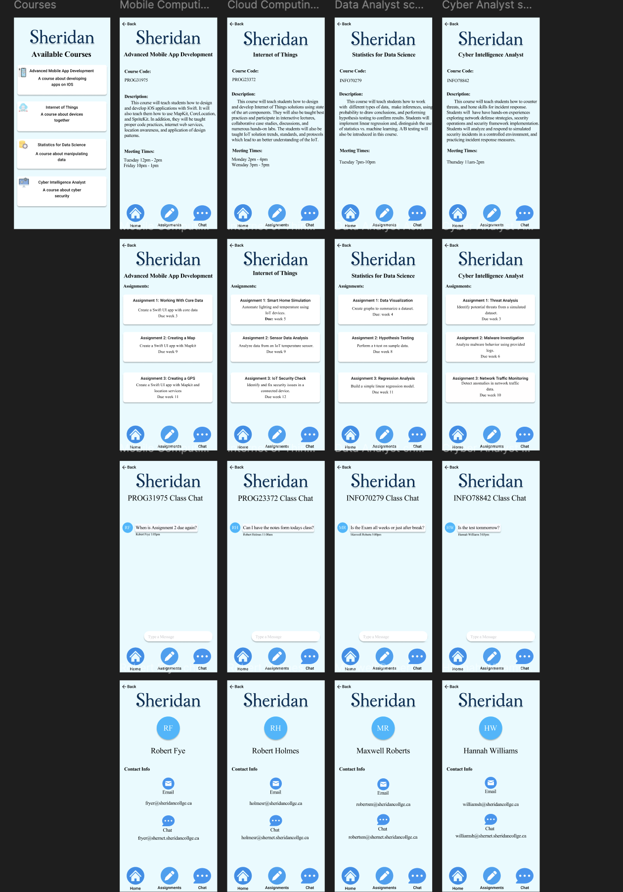
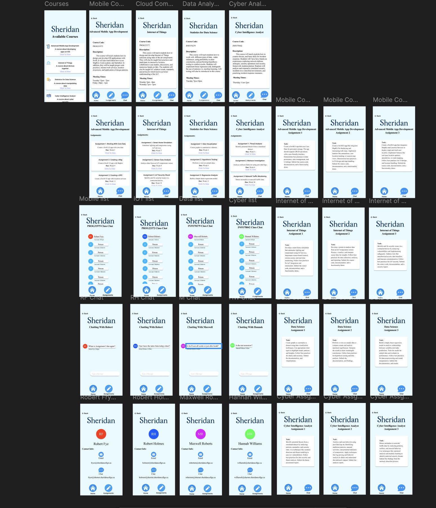
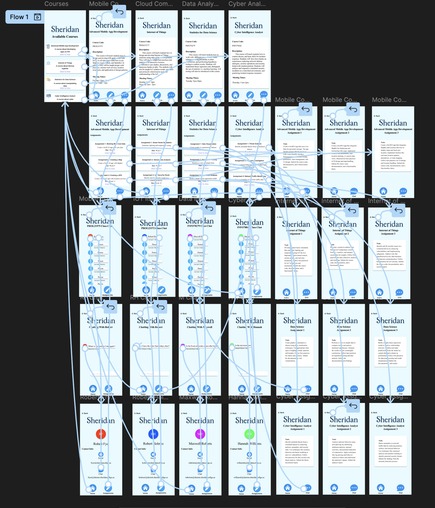

# SchoolApp

Documentation and prototype for SchoopApp. The app that shows info about courses. 

## Application Versions

1. [Version 1](https://www.figma.com/design/UiUIUZWnVkd0MqsI6XOPbt/Assigment_1?m=auto&t=mpJoxIwnXyLAiRyG-1)
2. [Version 2](https://www.figma.com/design/hw7jLsTwAH2120zVeDhjzH/Assigment_2?m=auto&t=71ufxhehpn8XkjRN-1)

## :books: Description

This app will be used to view course information. The user can select a course to see its description and course code. The assignments button can also be clicked to see upcoming course assignments. Upon clicking the user can view the details of the assignment. The user can also click the chat button to see a list of class contacts. These contacts can also be clicked to see thier details as weell as message them.

## Initial Prototype

## :woman_artist: Prototype

## :books: Navigation Prototype

## Links

- [Github Repository](https://github.com/AlecDivito/School-HCI-Assignment)
- [Figma Public Link](https://www.figma.com/design/hw7jLsTwAH2120zVeDhjzH/Assigment_2?m=auto&t=71ufxhehpn8XkjRN-1)
